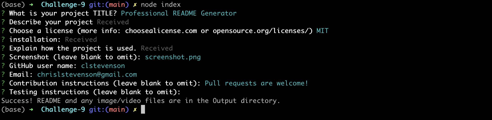

# Professional README Generator

## Description
Generating quality README files for GitHub repos is an important task: it describes your work, explains how and why to use it, and provides opportunities for collaboration with others. And yet often the README is generated almost as an afterthought once the hard work of coding an initial product is complete.

This app standardizes and simplifies the task of generatoring a quality README. It is a node.js app that operates through a command line interface, asking the user for information needed to generate a professional README. In fact, this document was itself generated by the app!

The app can also include a screenshot. Although not strictly necessary for a CLI, one is included below just to demonstrate the capability.

## Table of Contents
- [Installation](#installation)
- [Use](#use)
- [Questions](#questions)
- [Contribution Guidelines](#contribution-guidelines)
- [License](#license)

## Installation
This is a [Node.js](https://nodejs.org/en) app, it requires a working installation of Node and its npm package manager.

To install this app, download or clone the repo. Open a terminal and navigate to the app's directory and install the dependency (Inquirer) by typing `npm install` (or `npm i`). That will download the dependencies and store them in the node_modules subdirectory.

## Use
Start the app from the command line by typing `node index.js`. You will be prompted with a series of questions:

1. What is your project TITLE?
2. Describe your project.
3. Choose a license (more info: choosealicense.com or opensource.org/licenses/).
4. Describe the installation process.
5. Explain how the project is used.
6. GitHub user name:
7. Email:
8. Screenshot (leave blank to omit):
9. Contribution instructions (leave blank to omit):
10. Testing instructions (leave blank to omit):

Answers to the first five questions are required; default answers are provided, and blank responses will result in a prompt to re-enter your response. Some questions (numbers 2, 4, 5) will launch your default CLI editor. For MacOS and Unix that will be vim; for Windows the default CLI editor is currently Notebook. (These can be changed by creating/altering the `$VISUAL` or `$EDITOR` environment variables.) You can use the default responses, which will be loaded into the editor, as placeholders for later editing: simply close the editor (for vim that is done by typing `:q`). If you change the placeholder you must save your work in order to pass it to the app.

Questions 6-10 do not require responses. If you do not respond to questions 6-7 then there will be a place in the resulting README file to add that information. If you do not respond to questions 8-10 then the corresponding sections of the README will not be created.

The README is created with a name that includes your project title, for easy identification. You'll want to copy the file to your project root and rename it to README.md, and make any additional edits you want. If you included a screenshot it will be placed in output/assets/images/, as recommended by GitHub. You'll want to copy the entire tree to your project so that the image appears in your README.

A [video demo](https://youtu.be/ONeCuumIr4Y) of the process is available. 

## Questions
Reach out if you have questions that are not covered here!

- GitHub username: [clstevenson](https://github.com/clstevenson)
- email: chrislstevenson@gmail.com

## Contribution Guidelines
Pull requests are welcome!

## License
This project is licensed under the terms of the [MIT license](https://opensource.org/licenses/MIT).
